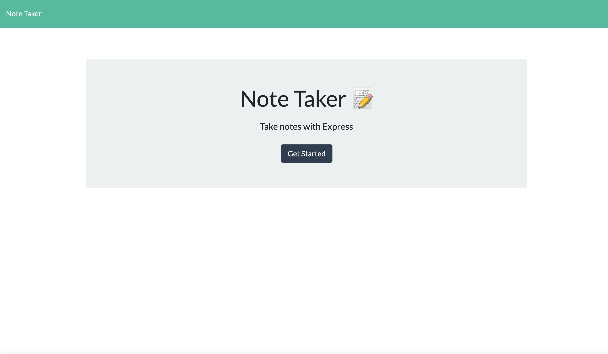

# note-taker
## Description

Note Taker is a small app that allows a user to create small notes.  The user is presented with a list of notes and can select one for reading.  He can create a new note and he can delete an existing note.

## Table of Contents
- [Installation](#installation)
- [Usage](#usage)
- [Credits](#credits)
- [Questions](#questions)
- [License](#license)

## Installation
The best way a person could install this app is to fork the repository and then connect the repository to a Heroku server.  Alternatively, the files can be be installed on the user's own server.  Use _npm install_ to install the dependent modules.
## Usage
WHen the user enters the app landing page, he is presented with a page displaying the app name and a _Get Started_ button.  The user clicks the button to get to the notes page.  Once on the notes page, the user can click on an existing note title on the left column of the page to read the contents of that note.  If he wants to create a new note, he can click the *+* in the top right corner.  The user than replaces the _Note Title_ text with the title of his new note and replaces the _Note Text_ text with the text of his note.  If he wants to delete a note he can click on the red trash can next to the note title in the left column.
## Credits
This application uses the *express* module to handle the server functions.  It also uses the *path* and *fs* modules to handle the system file operations such as reading and writing files.  Finally, it uses the *generate-unique-id* module to generate a unique id for each note.
## Questions
If you have any questions you can contact the author through his github user profile: https://github.com/bdstpierre
or by sending an email to barry@stpierre.com
## License
Copyright 2021 Barry St. Pierre

    Permission is hereby granted, free of charge, to any person obtaining a copy of this software and associated documentation files (the "Software"), to deal in the Software without restriction, including without limitation the rights to use, copy, modify, merge, publish, distribute, sublicense, and/or sell copies of the Software, and to permit persons to whom the Software is furnished to do so, subject to the following conditions:
    
    The above copyright notice and this permission notice shall be included in all copies or substantial portions of the Software.
    
    THE SOFTWARE IS PROVIDED "AS IS", WITHOUT WARRANTY OF ANY KIND, EXPRESS OR IMPLIED, INCLUDING BUT NOT LIMITED TO THE WARRANTIES OF MERCHANTABILITY, FITNESS FOR A PARTICULAR PURPOSE AND NONINFRINGEMENT. IN NO EVENT SHALL THE AUTHORS OR COPYRIGHT HOLDERS BE LIABLE FOR ANY CLAIM, DAMAGES OR OTHER LIABILITY, WHETHER IN AN ACTION OF CONTRACT, TORT OR OTHERWISE, ARISING FROM, OUT OF OR IN CONNECTION WITH THE SOFTWARE OR THE USE OR OTHER DEALINGS IN THE SOFTWARE.
    
  